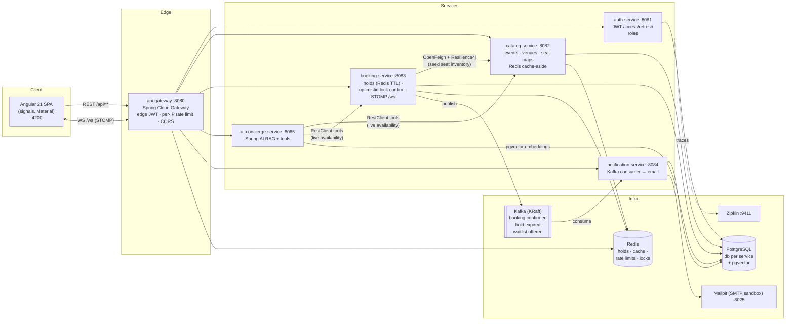
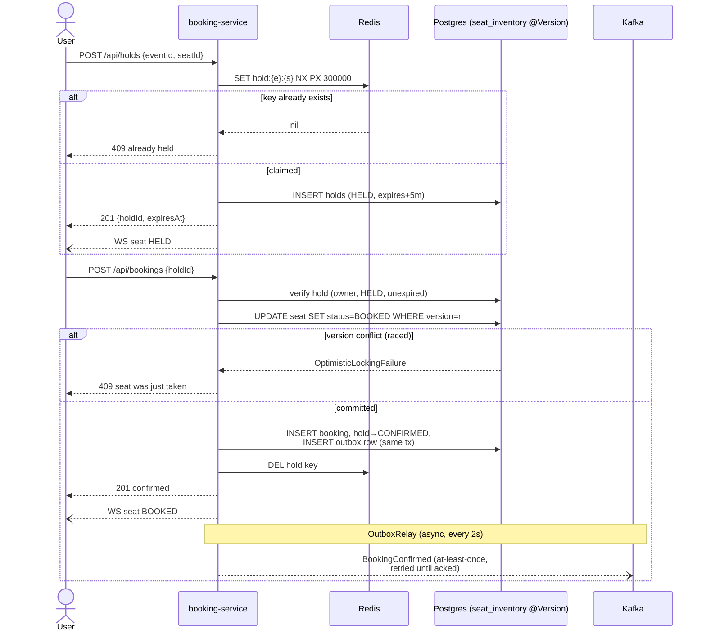

# SeatSync — Architecture

## The booking flow (hold → confirm), and why it can't oversell

**Three layers, one invariant (a seat sells at most once):**

1. **Redis `SET NX` hold** — atomic seat claim with a 300 s TTL. Filters ~all
   contention cheaply before any database write; expiry is free (TTL).
2. **DB hold record** — authoritative hold state and expiry timestamps; a
   scheduled job expires stale holds and emits `HoldExpired` (Redis keyspace
   events are best-effort, so the DB is the source of truth).
3. **JPA `@Version` optimistic lock on `seat_inventory`** — the *final* guard.
   Even if Redis lost the hold key (failover, flush) and two users both
   believe they hold the seat, only one `AVAILABLE → BOOKED` transition can
   commit; the loser gets a clean 409. Correctness never depends on Redis.

## Trade-offs, and what changes at 10× scale

- **Optimistic vs pessimistic locking**: contention on a given seat is brief
  and low (holds pre-filter it), so optimistic locking wins — no lock waits,
  no deadlocks, losers fail fast. Pessimistic `SELECT FOR UPDATE` would hold
  row locks across the confirm transaction for no benefit here.
- **Holds in Redis + DB**: Redis gives atomic claim + free expiry; the DB
  makes correctness independent of cache durability. The cost is dual writes
  — acceptable because the DB row is the only one correctness relies on.
- **Kafka publishes go through a transactional outbox** (added after the
  design review — see `design-review-2026-07-16.md`): the event row commits
  in the same transaction as the booking/hold change, and a relay publishes
  at-least-once (`FOR UPDATE SKIP LOCKED`, replica-safe) until the broker
  acks. Consumers dedupe on `messageId`. A Kafka outage delays notifications;
  it can never lose them or block a sale.
- **Replica-safety is designed in, not assumed**: the hold-expiry sweeper
  claims rows atomically (`SKIP LOCKED`) so N instances divide the work, and
  WebSocket broadcasts relay through a Redis pub/sub channel so every
  instance's clients see every seat change.
- **The Redisson seeding lock is honestly an optimization.** A lock lease that
  expires during a GC pause is not mutual exclusion — so correctness never
  rests on it: seat seeding is idempotent (`ON CONFLICT DO NOTHING`) and the
  only guarantees are the DB unique constraint and the `@Version` check. The
  lock exists to damp the first-touch seeding stampede, nothing more.
- **At 10× scale**: partition seat inventory by event (already the Kafka key);
  move hold expiry from polling to Redis keyspace notifications + a
  compensating sweep; swap the Redis STOMP bridge for a dedicated broker
  relay (RabbitMQ) once fan-out outgrows pub/sub; introduce read replicas for
  catalog and CQRS-style seat-state projections; and shard rate limiting at
  the edge. Overselling protection would *not* change: the per-row optimistic
  version check is already the smallest possible serialization point.
